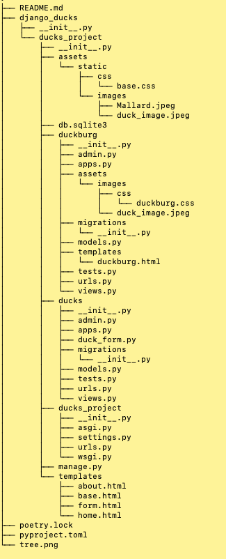

# Django Ducks

[Django Docs](https://docs.djangoproject.com/en/4.0/)

[PR](https://github.com/idcargill/django-ducks/pull/1)

## Django Setup Steps

- create virtual environment
- install Django
- django-admin startproject <project_name>

### Project Level

- python manage.py startapp <name_app>
- add app to project settings INSTALLED_APPS
- add app to project urls
- create project template folder
- add template folder to project
  > 'DIRS': [BASE_DIR /'templates'],

### APP Level

- build templates (project or app level)
- add app view
- add app urlpatterns

```python
from django.urls import path
from .views import HomePageView

urlpatterns = [
  path('', HomePageView.as_path(), name='home')
]
```

- add link to navigation
- add unit tests

### Server

- python manage.py runserver <port_optional>

### File Structure



#### Template Syntax

> 

> {{ variables }}

> {{ django|title }} (filter)

>{# comments #}
